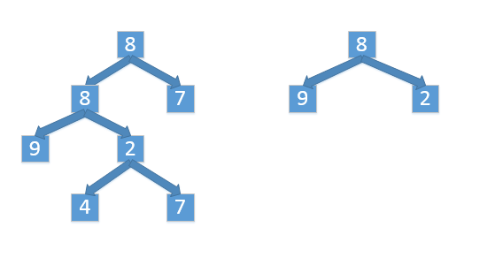

#树的子结构
##题目
输入两棵二叉树A和B，判断B是不是A的子结构。我们约定空树不是任意一个树的子结构。

##思路
先找到相同的根节点，再用递归去判断接下来的节点是不是都相同。
##代码
    import java.math.*;
    
    public class ProTwentysix {
        public boolean hasSonTree(TreeNode root1, TreeNode root2){
            boolean hasSon = false;
            if (root1 != null && root2 != null){
                if (new BigDecimal(root1.val).compareTo(new BigDecimal(root2.val)) == 0)
                    hasSon = hasSonCore(root1,root2);
                if (!hasSon)
                    hasSon = hasSonTree(root1.Left,root2);
                if (!hasSon)
                    hasSon = hasSonTree(root1.Right,root2);
            }
            return hasSon;
        }
        private boolean hasSonCore(TreeNode root1, TreeNode root2){
            if (root2 == null)
                return true;
            if (root1 == null)
                return false;
            if (new BigDecimal(root1.val).compareTo(new BigDecimal(root2.val)) != 0)
                return false;
            return hasSonCore(root1.Right,root2.Right) && hasSonCore(root1.Left,root2.Left);
    
        }
    }
    
    class TreeNode{
        double val;
        TreeNode Left;
        TreeNode Right;
        public TreeNode(double val){
            this.val = val;
        }
    }