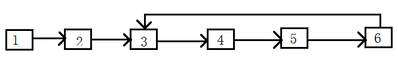

#链表中环的入口节点
##题目
一个链表中包含环，如何找出环的入口结点？例如，在下图的链表中，环的入口结点
是结点3

##思路
同样利用两个信号节点，前驱节点一次移动两个位置，后驱一次移动一个位置，如果有
环，因为前驱节点比后驱节点速度大1，所以两个几点必定会相遇。
##代码
    public class ProTwentythree {
        public ListNode Entryofcircle(ListNode Head){
            if (Head == null || Head.next == null || Head.next.next ==null)
                return null;
            ListNode Node = Head;
            ListNode Tail = Node.next.next;
            while (Tail != null){
                if (Tail == Node){
                    Tail = Node.next;
                    int circleLength = 1;
                    while (Tail != Node){
                        Tail = Tail.next;
                        circleLength++;
                    }
                    Node = Head;
                    Tail = Head;
                    for (int i=0;i<circleLength;i++){
                        Tail = Tail.next;
                    }
                    while (Tail != Node){
                        Node = Node.next;
                        Tail = Tail.next;
                    }
                    return Tail;
                }
                else {
                    Node = Node.next;
                    Tail = Tail.next.next;
                }
            }
            return null;
        }
    }
