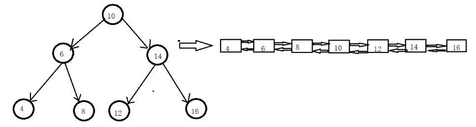

#二叉搜索树与双向链表
##题目
输入一棵二叉搜索树，将该二叉搜索树转换成一个排序的双向链表。要求不能创建任何新的结点，
只能调整树中结点指针的指向。
##思路
二叉搜索树在中序遍历后将会是有序的数列，因此可以用中序遍历来解决。

让每次遍历节点的左孩子、右孩子，把左孩子指向转换链表的尾节点，并把末尾指针的右孩子指
向自己。右孩子指向节点的右孩子。如果没有右孩子就返回。这一过程可以用递归实现。
##代码
    public class ProTirtysix {
        IntTreeNode head = null;
        IntTreeNode End = null;
        public IntTreeNode convert(IntTreeNode root){
            if (root == null)
                return null;
            covertCore(root);
            return head;
        }
    
        private void covertCore(IntTreeNode root){
            if (root == null)
                return;
            if (root.Left != null)
                covertCore(root.Left);
            if (End == null){
                head = root;
                End = root;
            }
            else{
                End.Right = root;
                root.Left = End;
                End = root;
            }
            covertCore(root.Right);
        }
    }
    